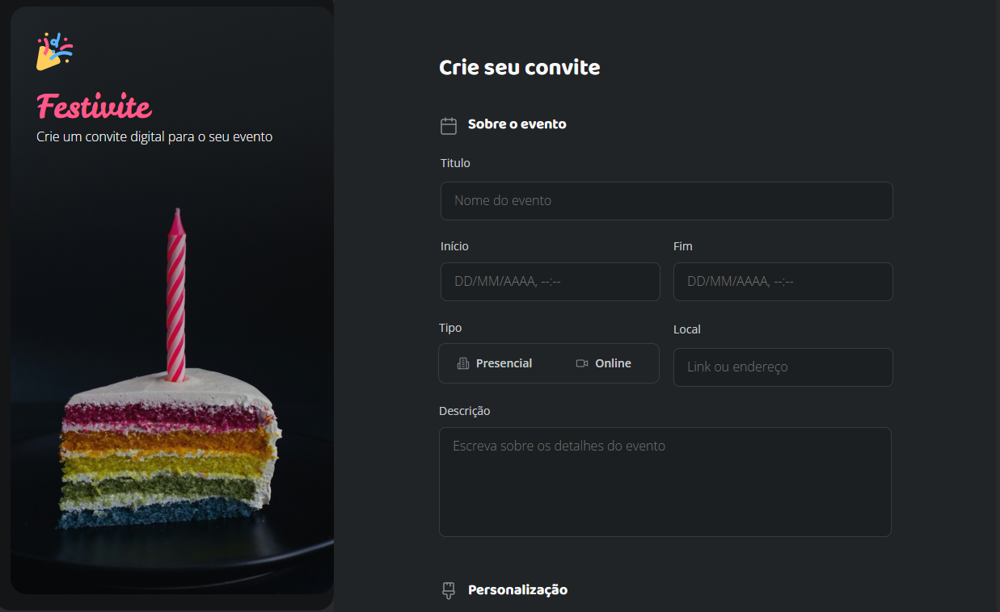
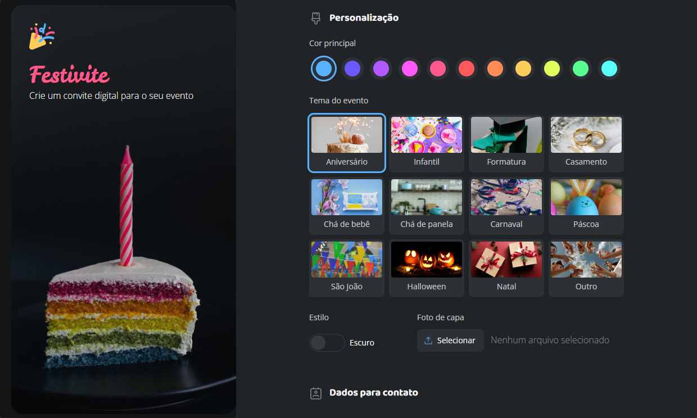
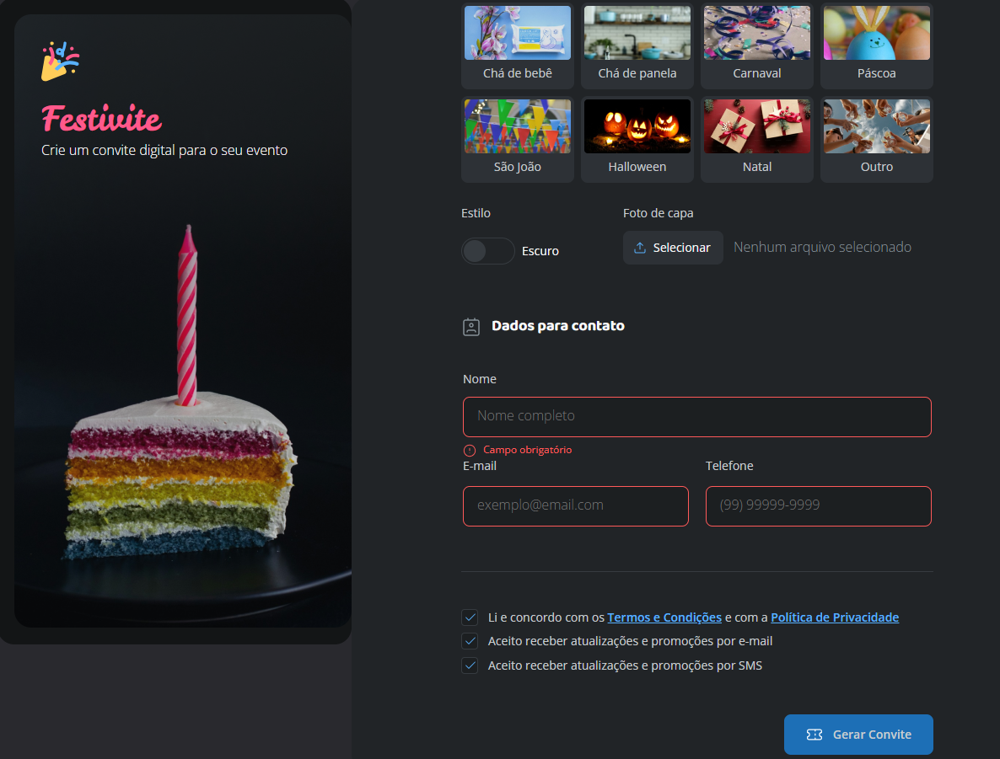

<h1 align="center"> Formulário de Convite </h1>

  Este é o terceiro projeto que desenvolvi com os conceitos que aprendi do curso Fullstack da Rocketseat. 
  <strong>O objetivo deste projeto é trabalhar os conceitos Grid, Flexbox e Formulários do CSS e HTML.</strong>

  <a href="#-tecnologias">Tecnologias</a>&nbsp;&nbsp;&nbsp;|&nbsp;&nbsp;&nbsp;
  <a href="#-projeto">Projeto</a>&nbsp;&nbsp;&nbsp;|&nbsp;&nbsp;&nbsp;
  <a href="#-layout">Layout</a>&nbsp;&nbsp;&nbsp;&nbsp;&nbsp;&nbsp;

 

   Utilizado input do tipo, text, radio, checkbox e file.
   
  
   
     
  Utilizado javascript para pegar o nome do arquivo ao realizar o input do arquivo.
   
  
   
     
  Adicionado obrigatoriedade no campo e pattern
   
   

## 🚀 Tecnologias

Esse projeto foi desenvolvido com as seguintes tecnologias:

- HTML e CSS
- Javascript
- Git e Github
- Figma

## 💻 Projeto

Esta página é um formulário de convite de festas da Festivite. 

---

Feito com ♥ by May
